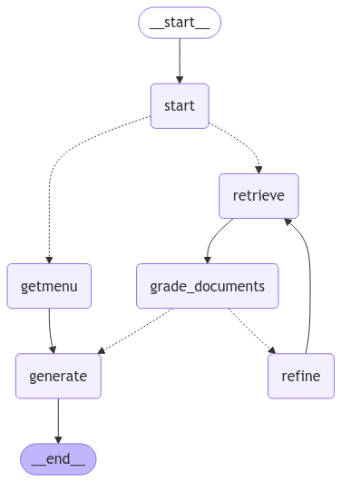

# HocamBot

HocamBot is a Retrieval-Augmented Generation (RAG) powered chatbot tailored for university students, designed to provide accurate, contextual answers by combining vector-based document retrieval with advanced language models.

# What HocamBot Does

HocamBot provides an intelligent chat interface for university society members by:
- Allowing users to ask questions about policies, resources and cafeteria.
- Retrieving precise, context-aware answers from uploaded documents.

# Features

- RAG Architecture : Integrates document retrieval with LLM-based answer generation for precise responses.
- Multiple Data Sources : Ingests DOCX files and other document formats to build the knowledge base.
- Vector Store : Uses ChromaDB for efficient embedding storage and similarity search.
- Query Refinement : Employs LangChain and LangGraph for structured query planning and execution.
- LLM Integration : Leverages Google Gemini 2.0 Flash exp for high-quality answer generation.
- Streamlit UI: Provides an interactive, easy-to-use web interface for end users.

# How to Start

## Prerequisites

 - langchain
 - langchain-community
 - langgraph
 - langchain-google-genai
 - python-dotenv
 - chromadb
 - langchain-chroma
 - jq
 - pytest
 - beautifulsoup4
 - streamlit

 you can check requirements.txt for versions


### Installation

1. **Clone the repository**

   ```bash
   git clone https://github.com/YourOrg/HocamBot.git
   cd HocamBot
   ```

2. **Install dependencies**

   Using Poetry:

   ```bash
   poetry install
   ```

   Or using pip:

   ```bash
   pip install -r requirements.txt
   ```

3. **Configure environment variables**

   Create a `.env` file in the project root:

   ```ini
   GEMINI_API_KEY=your_gemini_api_key
   LANGCHAIN_API_KEY=your_langchain_api_key
   ```

### Usage

1. **Run the Streamlit app**

   ```bash
   streamlit run main.py
   ```

2. **Open your browser** at `http://localhost:8501` to interact with HocamBot.

# Architecture Overview



- **Ingestion**: `scripts/ingest_docs.py` parses DOCX files, generates embeddings, and stores them in ChromaDB.
- **Query Planning**: LangGraph constructs a plan to retrieve and refine information.
- **Retrieval**: ChromaDB returns relevant document chunks.
- **Generation**: Google Gemini produces the final answer.
- **Presentation**: Streamlit serves the chatbot interface.
